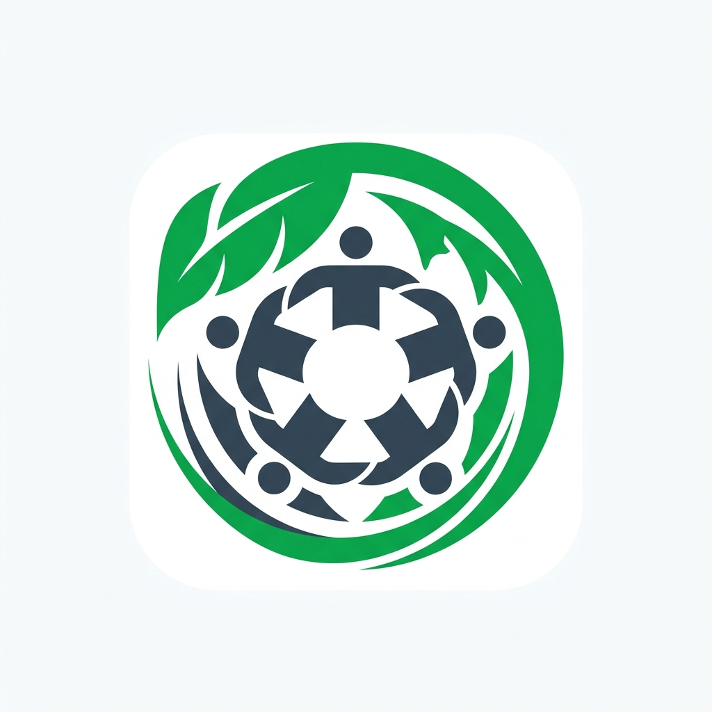

<div align="center">
  
  
  <h1>⚔️ GladiConnect</h1>
  <p><strong>A Professional Ecosystem for Social Impact & NGO Operations</strong></p>
  
  [](https://reactjs.org/)
  [](https://nodejs.org/)
  [](https://www.mongodb.com/)
  [](https://vitejs.dev/)
</div>

<br />

> _"Bridge the Gap. Amplify Impact."_

**GladiConnect** is a robust, full-stack (MERN) role-based platform built to connect **NGOs**, **Volunteers**, and **Corporate Funders**. Our mission is to facilitate transparent, efficient, and collaborative efforts that advance the **UN Sustainable Development Goals 16 (Peace, Justice & Strong Institutions)** and **17 (Partnerships for the Goals)**.

---

## 🚀 Key Features

### 🔐 Secure Role-Based Workflows
- **NGOs, Volunteers, and Corporate Funders** have dedicated dashboards and specialized tools.
- Intelligent routing and session management ensures data privacy and strict access control across the platform.

### 🏢 Comprehensive NGO Dashboard
- **Advanced Finance Suite:** Transparent end-to-end expense logging with digital bill/receipt attachments, automatic totals calculations, and campaign-specific financial tracking (Full CRUD support).
- **Campaign Management:** Launch, track, and conclude impact campaigns. Seamlessly link expenses to specific active or ended campaigns for flawless audits.
- **Impact Profile & Gallery:** Manage public-facing organizational details, social links, and an interactive media gallery.
- **Offline Event Logger:** Log activities locally even without an internet connection, preparing for sync once back online.

### 🤝 Volunteer Portal
- **Smart Directory:** Discover NGOs using intelligent domain and geographic filtering.
- **Interest Matching:** Connect instantly with organizations driving causes you care about.
- **Impact Tracking:** Maintain a living record of volunteered hours, participated campaigns, and earned digital badges.

### 💼 Corporate CSR Portal
- **Due Diligence Tracker:** Verify NGO credentials, registration status, and compliance data before funding.
- **Funding Allocation:** Monitor exactly where CSR funds are routed.
- **Compliance Reporting:** Extract clean, accurate impact and financial logs generated directly from the NGO Finance Suite.

---

## 🛠️ Architecture & Tech Stack

GladiConnect utilizes a modern **MERN** (MongoDB, Express, React, Node.js) architecture.

### Frontend
- **Framework:** React 19 + Vite for lightning-fast HMR and optimized builds.
- **Styling:** Custom Vanilla CSS Design System featuring Glassmorphism, tailored color palettes, and micro-animations.
- **Icons:** Lucide React for crisp, scalable UI iconography.
- **State & Context:** React Context API + LocalStorage/IndexedDB for offline capabilities.

### Backend
- **Runtime:** Node.js with Express.js REST API.
- **Database:** MongoDB (Mongoose ODMs) powering highly relational schemas (Users, NGOs, Campaigns, Finance Reports).
- **File Storage:** Base64 processing for digital attachments (bills, receipts) tightly coupled with financial records.

---

## 🎨 Design System

Our UI/UX is built to inspire trust, maintain absolute clarity, and provide a premium feel.

| Element       | Specification | Usage               |
| ------------- | ----------- | -------------------- |
| **Primary**   | `#1A5276` (Deep Ocean Blue) | Primary actions, branding, trust elements |
| **Secondary** | `#1E8449` (Forest Green) | Success states, growth metrics, positive impact |
| **Background**| `#F4F7F6` (Cool Grey) | Clean, distraction-free application backdrop |
| **Typography**| `Outfit` (Google Fonts) | Modern, highly legible sans-serif for all UI text |

- **Glassmorphism:** Elegant, translucent cards providing depth.
- **Micro-interactions:** Smooth hover states, transition effects, and intuitive modal overlays (e.g., Delete Confirmations, Image Previews).

---

## ⚡ Quick Start Guide

Ready to run GladiConnect locally? Follow these steps:

### 1. Database Setup
Ensure you have [MongoDB](https://www.mongodb.com/try/download/community) installed and running locally on the default port (`mongodb://localhost:27017/gladiators`).

### 2. Start the Backend Server
```bash
# Navigate to the server directory
cd server

# Install backend dependencies
npm install

# (Optional) Seed the database with mock data
node seed.js

# Start the Express API server (runs on Port 5000)
npm run dev
```

### 3. Start the Frontend Application
Open a new terminal window:
```bash
# Return to the project root
cd ..

# Install frontend dependencies
npm install

# Start the Vite development server
npm run dev
```

Navigate to `http://localhost:5173` in your browser to experience GladiConnect!

---

## 📂 Project Structure

```text
gladiators-ngo/
├── server/                    # Node.js + Express Backend
│   ├── models/                # Mongoose Schemas (Campaign, FinanceReport, etc.)
│   ├── routes/                # REST API Endpoints (/api/finance, etc.)
│   └── server.js              # Server entry point & configuration
│
├── src/                       # React 19 Frontend
│   ├── components/            # Reusable UI components (Modals, Alerts, Nav)
│   ├── context/               # Global State (Auth, Theme, Confirm Dialogs)
│   ├── pages/                 # Role-based Dashboards & Onboarding Flows
│   │   ├── ngo/               # NGO-specific tools (Finance Suite, Campaigns)
│   │   ├── volunteer/         # Volunteer discovery & tracking
│   │   └── company/           # Corporate CSR verification tools
│   ├── App.jsx                # Routing & Authentication Guards
│   └── index.css              # Global Design System tokens
│
└── package.json               # Frontend dependencies & scripts
```

---

## 👥 Team Gladiators

Built with ❤️ and purpose by **Team Gladiators** from Vidya Vardhaka College of Engineering, Mysuru.

> _"Alone we can do so little; together we can do so much."_ — Helen Keller
